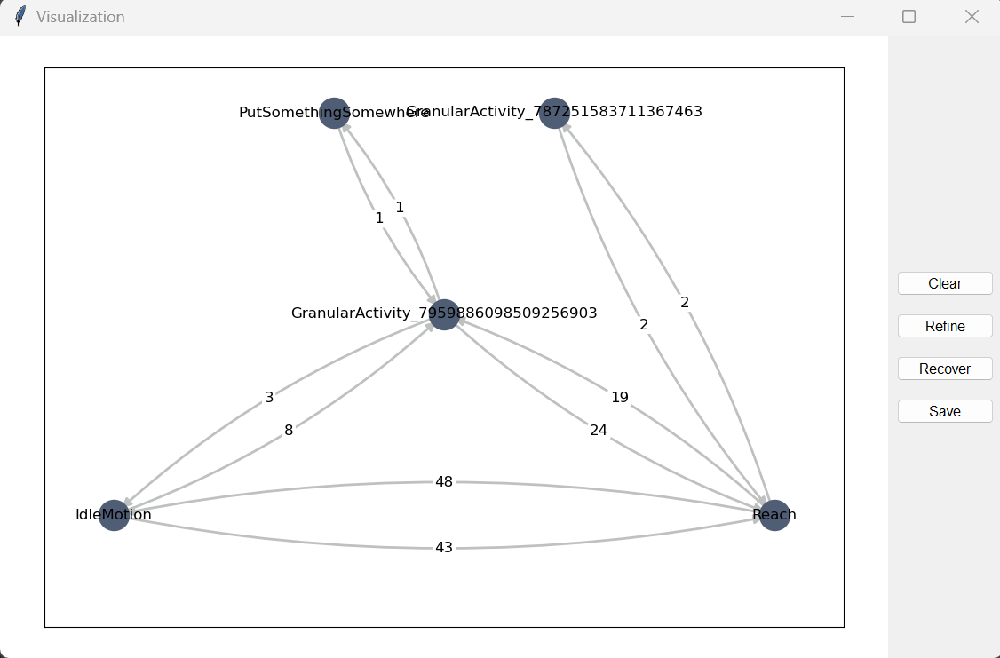
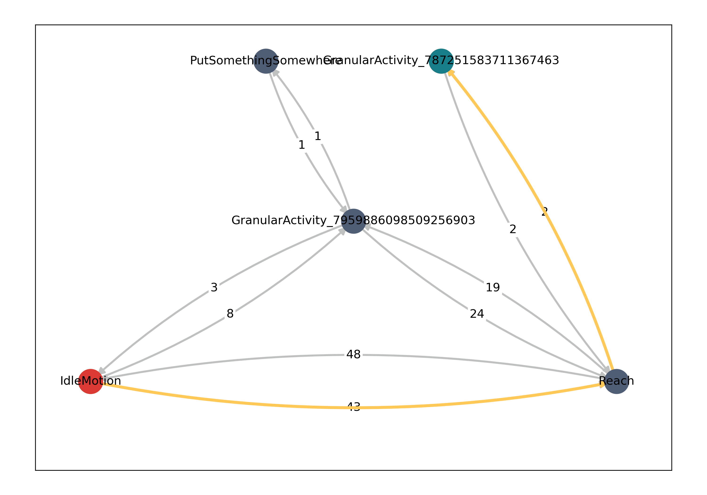
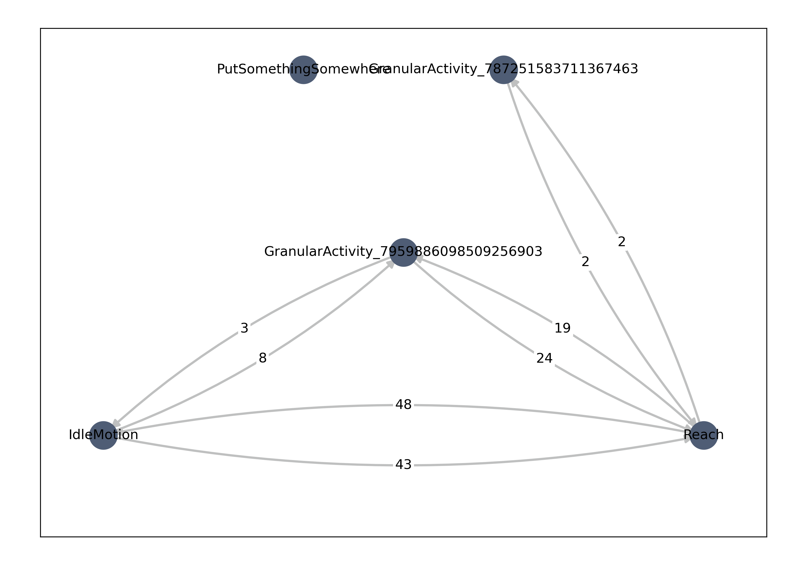

## Learning Graph Structures for Collaborative Tasks

### Install
```bash
pip install -r requirements.txt
python main.py
```
### UI introduction
The window looks like:



Once the graph is built, you can select start node and end node by click it, then a solution between these nodes will be highlighted



`Clear` means you can clear the selected nodes and choose another pair.

`Refine` will remove unnecessary edge and node through additional rich information.



`Recover` will back to original graph structure.

`Save` will save current graph image to your computer.